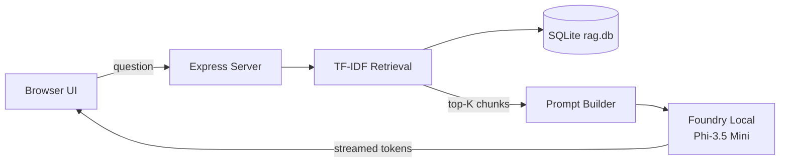

# LocalRAG Study Assistant

<p align="center">
  
  
  
</p>

<p align="center">
  <strong>An offline document Q&amp;A assistant</strong> for a campus Local AI lab handbook.<br/>
  Built with <a href="https://learn.microsoft.com/azure/ai-foundry/foundry-local/">Microsoft Foundry Local</a>, Express, SQLite, and TF-IDF retrieval.
</p>

<p align="center">
  <em>Summer School project · Bartu Dönmez</em>
</p>

---

## Why this exists

Large language models are great at fluent answers — and terrible at inventing facts about *your* notes.

**LocalRAG** fixes that with the RAG pattern:

1. **Retrieve** the most relevant passages from a local knowledge base  
2. **Augment** the prompt with those passages  
3. **Generate** an answer using a small on-device model (Phi-3.5 Mini)

No cloud API keys. No outbound calls after the first model download. Your documents stay on disk.

---

## Features

| | |
|---|---|
| **Fully offline** | Inference via Foundry Local SDK after model cache |
| **Grounded answers** | Responses cite retrieved document chunks |
| **Local vector store** | SQLite + TF-IDF — zero extra infrastructure |
| **Modern study UI** | Soft paper theme, streaming chat, source panel |
| **Runtime uploads** | Drop `.md` / `.txt` files into the knowledge base |
| **Student-ready docs** | 12 handbook files: lab hours, rubric, errors, booking, delivery |

---

## Architecture



Everything runs on **one laptop**.

| Layer | Technology | Role |
|-------|------------|------|
| Client | Single HTML + CSS | Chat UI, quick prompts, upload modal |
| Server | Node.js + Express | Chat / status / upload APIs |
| Retrieval | TF-IDF + cosine similarity | Fast offline ranking |
| Data | SQLite (`data/rag.db`) | Chunks + vectors |
| AI | Foundry Local + Phi-3.5 Mini | On-device generation |

---

## Quick start

### Prerequisites

- **Node.js 20+**
- **Foundry Local**  
  ```powershell
  winget install Microsoft.FoundryLocal
  ```
- ~2 GB free disk for the first model download  
- Ideally **4 GB+ free RAM** while the model loads

### Run

```bash
npm install
npm run ingest
npm start
```

Open **[http://127.0.0.1:3000](http://127.0.0.1:3000)**

> First launch downloads the chat model. Later launches reuse the local cache and can work offline.

---

## Example questions

Ask for **specific facts** (this is where RAG shines):

- What are the Local AI Lab opening hours in room B-214?
- How many points is the offline Q&A criterion worth in the rubric?
- What is the late submission policy after the deadline?
- How do I fix EADDRINUSE on port 3000?
- When do demo booking slots open each week?
- TF-IDF or embeddings — what does this lab require to pass?

Also try something **outside** the handbook (e.g. “Who is the current emperor of Atlantis?”). The assistant should refuse when context is missing — this matches the summer-school **responsible refusal** criterion.

---

## Project layout

```text
docs/           Knowledge base (Markdown) — edit & re-ingest
src/            Server, RAG pipeline, prompts, vector store
public/         Chat UI
scripts/        Small diagnostics helpers
data/rag.db     Generated index (created by ingest — not committed)
```

### Customize for your domain

1. Replace files in `docs/` with your own Markdown  
2. Edit `src/prompts.js` for role & refusal rules  
3. Tune `chunkSize`, `chunkOverlap`, `topK` in `src/config.js`  
4. Run `npm run ingest` again  

---

## How retrieval works

This project uses **TF-IDF** (not neural embeddings) on purpose:

- Fully offline — no embedding model to download  
- Sub-millisecond ranking on a small corpus  
- Transparent term weights for learning  

For larger or highly paraphrased collections, you can later swap in a local embedding model. For a student knowledge base of ~10 documents, TF-IDF is clear and effective.

---

## Scripts

| Command | Description |
|---------|-------------|
| `npm run ingest` | Chunk docs → TF-IDF → SQLite (uses best chunk settings if trained) |
| `npm start` | Start UI + load Foundry Local model |
| `npm run train` | Full RAG trainer: sweep chunk/topK + candidate models/temperatures |
| `npm run train:quick` | Faster trainer (smaller grid, fewer cases) |
| `npm test` | Run built-in Node test suite |
| `npm run dev` | Start with `--watch` |

### Built-in trainer (find the best local configuration)

This project does **not** fine-tune neural weights (that is out of scope for Foundry Local summer demos). Instead it runs an **offline evaluation trainer** that:

1. **Phase A** – sweeps `chunkSize`, `chunkOverlap`, `topK` and scores **retrieval hit-rate** on gold questions in `eval/cases.json`
2. **Phase B** – tries available Foundry **model candidates** + **temperatures**, scores grounded answers and refusals
3. Writes the winner to `config/best-config.json` and rebuilds `data/rag.db`
4. On next `npm start`, `src/config.js` loads those winning parameters automatically

```bash
npm run train:quick   # smoke run
npm run train         # fuller search (slower; needs RAM + model(s))
```

Optional model list:

```bash
npm run train -- --models=phi-3.5-mini,phi-4-mini
```


---

## Learning outcomes

By building and demoing this app you practice:

- Retrieval-Augmented Generation end-to-end  
- On-device SLMs with Foundry Local  
- Local persistence with SQLite  
- Prompt design that reduces hallucination  
- Shipping a small full-stack AI demo (UI + API + data)

---

## Credits

Inspired by Microsoft’s sample:

- Blog: [Building Your First Local RAG Application with Foundry Local](https://techcommunity.microsoft.com/blog/azuredevcommunityblog/building-your-first-local-rag-application-with-foundry-local/4501968)  
- Original repo: [leestott/local-rag](https://github.com/leestott/local-rag)  

Adapted as a **LocalRAG Study Assistant** for the Microsoft CSU Turkey summer school track — new knowledge base, prompts, branding, and UI.

---

## License

MIT
